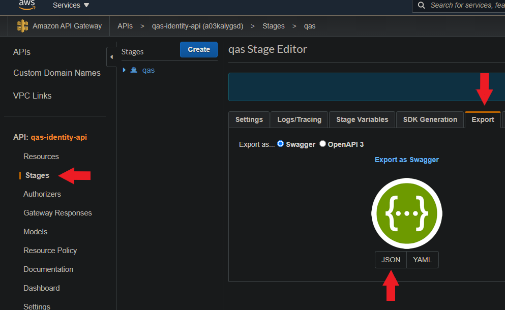

Todos los servicios tendran un contrato donde se describiran las funciones y datos a utilizar, para ello
se documentara en el archivo de configuración principal (serverless.yml) usando el estandar swagger.

# Estructura de datos
Se tiene una carpeta de documentacion en la raiz del modulo (modulo.documentation)
Dentro de esta carpeta se tendran 3 secciones importantes:

# Models

Esta carpeta contendran todas las entidades que se usaran en los servicios (input/outputs) en formato json schema.

```json
{
    "type": "object",
    "properties": {
        "idUser": {
        "type": "string"
        } ,
        "nombre": {
        "type": "string"
        } ,
        "dni": {
        "type": "string"
        }
    }
}
```

# Serverless.doc.yml

Es el archivo principal de la configuració?n swagger para serverless, tendra la siguiente estructura:

-   `Api:` Datos genericos del api

-   `Models:` Referencia a los archivos json schema creados en la carpeta models

```yaml
documentation:
    Api:
        info:
            version: '3' #Version del api
            title: 'empresa-account-api' #Nombre del api/modulo
            description: 'Funciones Lambda asociados a Cuenta' #Descripcion funcional del api/modulo
    models:
        - name: 'ErrorSchema' #Nombre del esquema, servira para poder invocarlo desde otras secciones yml
          description: 'Schema de error' # Descripcion del esquema/entidad
          contentType: 'application/json' #Formato del esquema, para apis siempre sera application/json
          schema: ${file(documentation/models/ErrorSchema.json)} #Ubicacion del archivo json schema
```

# MethodResponses

Carpeta donde se guardaran las estructuras de las respuestas genericas de los servicios, siguiendo la estructura

```yaml
http400:  #nombre/identificador de la respuesta
    statusCode: '400' #Codigo http de respuesta
    responseBody:
       description: 'BAD REQUEST 400' #Descripcion de la respuesta
    responseModels:
       application/json: 'ErrorSchema' #Nombre del schema creado en archivo serverless.doc.yml (documentation.model.name)
```

# Configuración en servicios

Cuando ya se tienen configurados todos los modelos/schemas en la carpeta de documentation, se podra iniciar la configuración de estos
en el serverless.yml del modulo.
Para ello se debe agregar el tag documentation dentro del tag api de una funcion

```yaml
deletePerson:
  handler: src/controller/handler.deletePerson
  events:
    - http:
        path: /person/{personId}/me
        method: delete
        cors: true
        authorizer:
          arn: '${self:custom.authorizer.arn}'
          identitySource: method.request.header.id-token
          type: request
        documentation:
```

Este tag contendrá? toda la espcificacion del servicio

## Request / Response

```yaml
documentation:
  summary: 'Borrar seguro' #Resumen del servicio
  description: 'Borrar un seguro agregado (solo nube)' #Descripcion del servicio
  requestBody: # Seccion de la estructura del request
    description: 'Input data to build a ChangePayer/AppointmentAdmission request' # Descripcion del request
  requestModels:
    application/json: 'AppointmentAdmissionRequest'  #Json Schema del request, debe hacer referencia al nombre creado en el serverles.doc.yml
  methodResponses: #Seccion de la estructura del response
    - statusCode: '204' #Codigo http que respondera el servicio
      responseBody:
        description: 'Empty' #Descripcion de la respuesta
      responseModels:
        application/json: 'EmptySchema' #Json Schema de la respuesta, debe hacer referencia al nombre creado en el serverles.doc.yml
    - ${file(documentation/methodResponses/error.yml):http400} #En el caso de tener respuestas genericas se puede poner una referencia a la carpeta methodResponse para usarlas directamente y hacerlo menos verboso.
    - ${file(documentation/methodResponses/error.yml):http401}
```

## Headers

```yaml
documentation:
    summary: 'Seguros agregados'
    description: 'Listar de seguros agregados'
    requestHeaders:
      - name: 'id-token'
        description: 'Header de Cognito'
        schema:
          type: 'string'
```

## Path Params

```yaml
documentation:
  summary: 'Borrar seguro'
  description: 'Borrar un seguro agregado (solo nube)'
  pathParams:
    - name: 'insuranceId'
      description: 'Id de seguro'
      required: true
```

## Query Params

```yaml
documentation:
  summary: 'Seguros agregados'
  description: 'Listar de seguros agregados'
  queryParams:
    - name: 'clinicId'
      description: 'Id de clí?nica opcional'
```

# Generación de archivos swagger

Una vez terminada la configuración de en el archivo serverless.yml, se podran generar los archivos swagger.
Estos archivos se generaran de manera automatica en el GW de AWS y podran ser descargados.

## Generación de archivos local

No se podra generar un archivo swagger en local pero se puede usar el plugin serverless-openapi-documentation para generar
un archivo con la especificacion OpenApi 3.0 que nos servira para validar de que toda la configuracion fue correcta,
para ello usar el siguiente comando:

```shell script
$ serverless openapi generate -f json
```

## Generación de archivos desde Aws

### Por comandos

Si el servicio ya esta desplegado en AWS, se puede usar el siguiente comando para descargar el archivo swagger (OpenApi 2.0).

```shell script
$ serverless downloadDocumentation --outputFileName=downloadedDocs.yml
```

## Por consola AWS

Desde la pagina del GW del servicios

