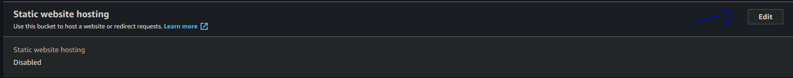
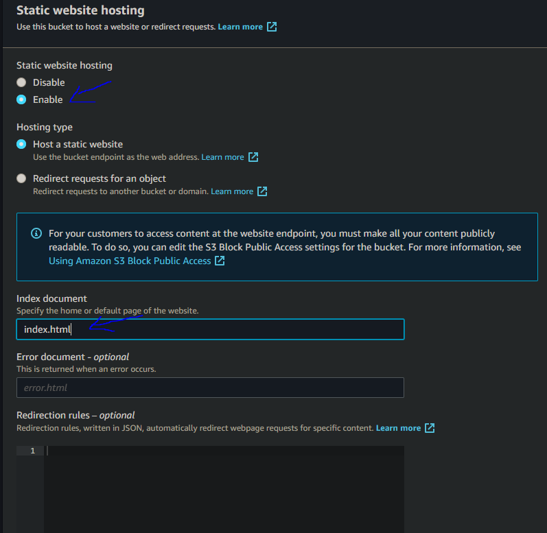
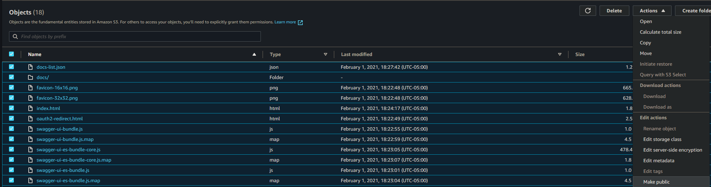
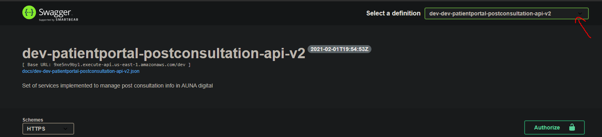

Luego de configurar la sección de swagger en el serverless framework estos archivos (json/yml) podran ser descargados desde el gw de aws, este gw no tiene un visor de archivos swagger por ello para una mejor gestion interna de los servicios construidos, se genero una aplicación swagger ui.

# Configuración

## Configuración de usuario aws
El sistema donde se realizara la carga de archivos swagger debera tener un usuario de aws configurado.
Para ello ir a la sección [Configuración base](ConfiguracionInicial)

## Instalación de JQ
Como sera necesario filtrar ciertos archivos json al descargarlos desde el gw de aws, sera necesario instalar esta libreria en el sistema.

### Linux

- Distribuciones basadas en debian `sudo apt-get install jq`

- Distribuciones basadas en RPM `sudo yum isntall jq`

## Creación de bucket

1.  Generar un s3 bucket con la siguiente nomemclatura:

- `auna-swagger-{stage}`

2. Habilitar el bucket como statis web hosting
    - En properties, seleccionar edit

  
    - Seleccionar enable e ingresar la pagina de inicio (index.html) en la seccion de index document
    

3. El bucket deberá tener la siguiente politica
   ```json
    {
        "Version": "2012-10-17",
        "Statement": [
            {
                "Sid": "PublicReadGetObject",
                "Effect": "Allow",
                "Principal": "*",
                "Action": [
                    "s3:GetObject"
                ],
                "Resource": [
                    "arn:aws:s3:::<Bucket Name>/*"
                ]
            }
        ]
    }
    ```

## Importación de aplicación swagger UI

1. Ingresar al github de swagger y descargar la ui base: https://github.com/swagger-api/swagger-ui/releases
2. Reemplazar el index de la UI base con el siguiente <a href="files/index.html" download>Index.html</a>
3. Subir todos los archivos de ui al bucket creado
4. Dar permiso publico a los archivos

   
Validar el archivo index, con esto ya se tiene una GU cargada.

# Carga de archivos swagger

## Ejecución de script masivo ([deploySwaggerAll.sh](files/deploySwaggerAll.sh))

Se generó un script bash masivo que nos permite descargar todos los archivos swagger creados en los gw que coincidan con el ambiente solicitado y cargarlos en la swagger ui

-   `input:`
    -    stage: El unico parametro sera el stage del cual se quieren descargar los archivos swagger para cargarlos a la ui.
    Este valor debe coincidir con el stage configurado en el serverless framework.
-   `output:` Log de ejecución.

Ejecución del script:

Solo ejecutar el comando:
`sh deploySwaggerModule.sh {stage}`

ejemplo: `sh deploySwaggerModule.sh dev`

### Flujo del script

1. Crea una carpeta temporal llamada docs.
2. Escribe el archivo en blanco docs-list.json
3. Buscar todos los servicios desplegados con el comando apigateway get-rest-apis y filtrando con el stage
4. Valida todos los stage del gw (diferente al stage serverless framework)
5. Exporta los archivos swagger con el comando apigateway get-export --rest-api-id
6. Guarda todos los swagger descargados en la carpeta docs   
7. Crea un json array con los datos de los swagger descargados en el archivo docs-list.json con el siguiente formato
   {"url": "docs/swaggerFile.json", "name": "swaggerName"}
8. Sube la carpeta docs y el archivos docs-list.json al bucket


# Visualización de definiciones swagger

Para poder visualizar el swagger ui, se debera abrir el index.html del bucket, esta web tendra un combo box donde se podra elegir el servicio a visualizar:




